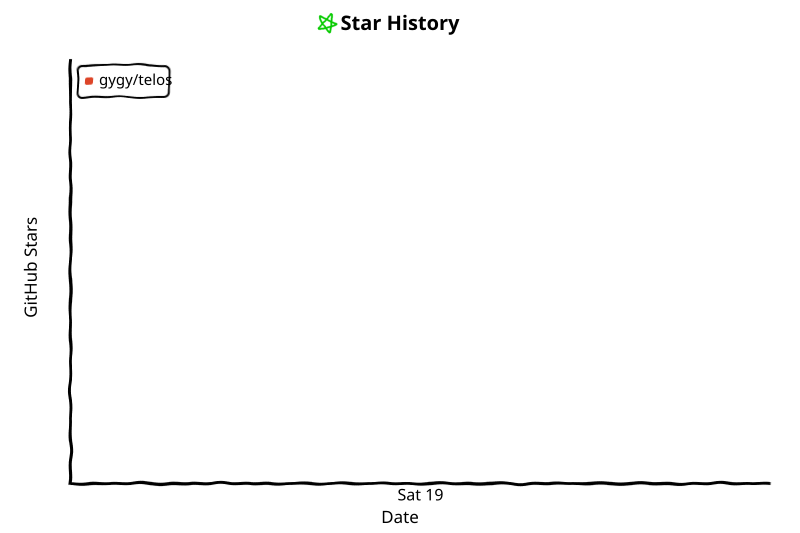
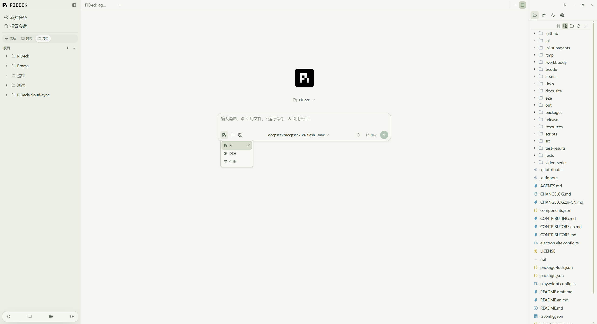
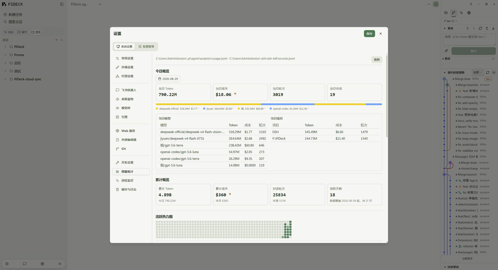
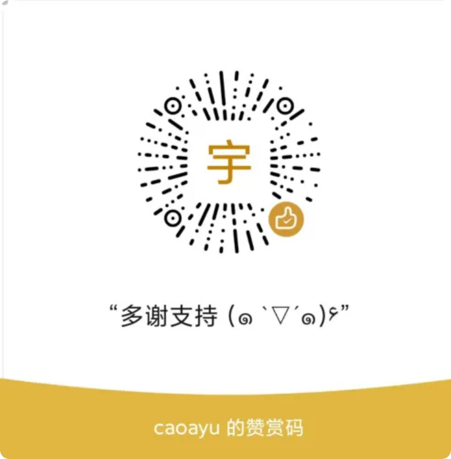

# Telos

[涓枃鏂囨。](README.md) 路 [English](README.en.md) 路 [LinuxDO 鍙嬮摼](https://linux.do)

**An open-source desktop workbench for managing multiple [Pi](https://pi.dev) and [DSH](https://github.com/deepseek-ai/deepseek-harness) coding-agent sessions.**


<!-- star-history:start -->
<picture>
  <source media="(prefers-color-scheme: dark)" srcset="assets/star-history/star-history-dark.svg">
  
</picture>
<!-- star-history:end -->




---

## What is Telos

**Telos** is an open-source desktop workbench for pi and DSH that manages pi Agent sessions across local project folders, with import support for local Codex and Claude sessions so you can browse and restore them in one place. It is based on upstream [PiDeck](https://github.com/ayuayue/PiDeck). Built with Electron + TypeScript, it provides multi-project workspace management, AI session history, Git integration, built-in terminal, visual config management, and plugin extensions 鈥?so local AI coding assistants stay consistent, traceable, and configurable across projects.

**Who it's for:** Developers who want to manage multiple local-project AI coding assistant sessions from a desktop app, review session history and Git status in one place, and configure pi through visual editors instead of raw JSON files.

`Telos` is **not** a fork of pi. It is a lightweight Electron shell that orchestrates multiple `pi --mode rpc` processes, providing a native desktop UI for projects, sessions, conversations, configuration, and tool orchestration 鈥?all powered by pi's native agent capabilities, with session files read and written natively by pi. Beyond pi, Telos also deeply integrates the **DSH (DeepSeek Harness)** backend 鈥?see [DSH Backend](#-dsh-backend).

---

## 馃搼 Table of Contents

- [Telos](#telos)
  - [What is Telos](#what-is-telos)
  - [馃搼 Table of Contents](#-table-of-contents)
  - [鉁?Highlights](#-highlights)
  - [馃搵 Changelog](#-changelog)
    - [v0.7.5-beta Release Highlights](#v075-beta-release-highlights)
  - [馃З Features](#-features)
    - [Workspace & Projects](#workspace--projects)
    - [Sessions & Conversation](#sessions--conversation)
    - [Files 路 Git 路 Terminal](#files--git--terminal)
    - [Models & Configuration](#models--configuration)
    - [Extensions & Ecosystem](#extensions--ecosystem)
    - [Desktop & System Integration](#desktop--system-integration)
  - [馃惓 DSH Backend](#-dsh-backend)
  - [馃彈锔?How It Works](#-how-it-works)
  - [馃摝 Download](#-download)
  - [馃О Quick Start (from Source)](#-quick-start-from-source)
  - [鉂?FAQ](#-faq)
  - [馃鈥嶐煉?Development](#-development)
    - [Browser Preview Mode](#browser-preview-mode)
    - [Project Structure](#project-structure)
  - [馃 Contributing](#-contributing)
  - [馃挰 Community](#-community)
  - [馃敀 Security & Privacy](#-security--privacy)
  - [鈽?Sponsor](#-sponsor)
  - [License](#license)

---

## 鉁?Highlights

- 馃枼锔?**Multi-project, multi-session in parallel** 鈥?manage every agent session across your local projects from one window, fully isolated per project.
- 馃攲 **Three session backends** 鈥?pi, DSH (DeepSeek Harness), and Image Generation side by side, freely switchable within the same project.
- 馃 **Context-aware composer** 鈥?`@` file references, `/` slash commands, and `!` shell execution, all in one input box.
- 馃梻锔?**Sessions as assets** 鈥?browse and restore history, import Codex / Claude sessions, one-click HTML export.
- 馃洜锔?**Visual configuration** 鈥?edit pi's `models.json` / `auth.json` / `settings.json` without hand-writing JSON, with one-click connection tests.
- 馃搳 **Usage at a glance** 鈥?provider balance/quota queries plus local session usage stats (heatmap, daily/model/project breakdowns).
- 馃О **The full workbench** 鈥?file tree, Git panel, built-in terminal, built-in browser, scratchpad 鈥?no window juggling.
- 馃惥 **Delightful desktop integration** 鈥?desktop pet, theme switching, system tray, Feishu bot, LAN web access.

---

## 馃搵 Changelog

> **Latest: v0.7.9** (2026-09-17)

### v0.7.9 Release Highlights
- ✨ **Faster cold start**

[View Full Changelog →](CHANGELOG.md)

---

## 馃З Features

### Workspace & Projects

| Feature | Description |
|---|---|
| **Multi-Project Workspace** | Add, search, drag-sort, and switch between local project folders. Run multiple pi agents simultaneously with per-project isolation. |
| **Built-in Chat** | A fixed Chat entry at the top of the project list writes to the app user-data directory for general conversations that do not need a code project. |
| **Session Bootstrap Page** | Preselect model and thinking level when creating a session, with `@` file references 鈥?ready to chat out of the box. |
| **Trust Confirmation System** | Desktop-intercepted trust confirmation; untrusted projects can still be opened; projects with running agents cannot be deleted. |

### Sessions & Conversation

| Feature | Description |
|---|---|
| **Dual Agent Backends (pi / DSH)** | Create pi or DSH sessions under the same project and switch between them freely 鈥?see [DSH Backend](#-dsh-backend) below. |
| **Image Generation Mode** | A standalone image-generation backend (OpenAI-compatible `/images/generations`; OpenAI / Volcengine / SiliconFlow, etc.), switchable inside a session. |
| **Plan Mode** | Switch to Plan Mode from the composer toolbar 鈥?the agent generates a plan, executes step by step with confirmation, and returns to the menu on cancel. |
| **Ask Parallel Queries** | Spin up standalone background query sessions that run in parallel, optionally carrying the main-session context, with one-click quoting back into the main composer. |
| **Session Activity View** | Thinking notes, tool calls, and answer updates are grouped into a compact flow with expandable/copyable details and clear status or exit-code labels. |
| **Answer-level File Summary** | Each completed answer lists the files modified in that turn with changed line counts; the Files panel keeps the whole-session overview. |
| **Todo Bar** | A persistent agent task list above the composer 鈥?pending / in-progress / done at a glance. |
| **Message Edit/Delete** | Copy, edit, and delete AI responses and user messages; edited text is backfilled to the composer for re-sending. |
| **Session Management** | Create, rename, copy, export HTML, delete history, restart & reload, close agents 鈥?from the sidebar or context menus. |
| **Session Import** | Import local Codex and Claude sessions from the project context menu, then browse or restore them as Telos history sessions. |
| **Ruler Rail** | A right-edge ruler maps timeline positions so you can jump to any message in long sessions. |
| **Content Width Restriction** | Draggable content width slider (unlimited by default) for long code lines or compact layouts. |

### Files 路 Git 路 Terminal

| Feature | Description |
|---|---|
| **File Drawer** | Project file tree with Git status indicators and a built-in file editor; the Files panel keeps the current-session modified file list. |
| **External Editor Integration** | "Open in Editor / Reveal in File Manager" auto-detects the system file manager and scans JetBrains IDE directories. |
| **Git Integration** | Real-time branch display with local + remote branch selector, branch count badge, switching, and branch creation. |
| **Embedded Terminal Dock** | Agent-scoped terminal tabs with PowerShell/cmd/sh fallback, multiple tabs, theme switching, height resizing, right-click selection copy, and close confirmation. |

### Models & Configuration

| Feature | Description |
|---|---|
| **Visual Config Management** | Visual editors for pi's `models.json`, `auth.json`, and `settings.json`: provider cards + model grid + type-aware key-value editing + raw JSON source editing, with save-and-restart to apply changes. |
| **Connection Tests** | One-click provider connection tests; model validation no longer misreports config fallback as success. |
| **Model Capability Auto-adaptation** | Compatible with pi 0.84.3: context window / maxTokens / thinking levels adapt to endpoint-reported values, with manual model catalog refresh so new models are never invisible. |
| **Usage Queries** | Provider balance/quota queries (built-in templates for OpenRouter, Moonshot-Kimi, and generic OpenAI-compatible gateways; multi-account and per-provider endpoints supported), shown on cards with custom probe configs. |
| **Usage Statistics** | Local statistics powered by the usage-stats plugin: cumulative overview, activity heatmap, daily usage, and model/project breakdowns. |
| **Proxy Settings** | Separate proxies for the pi agent process and the desktop app; model discovery and connection tests can use the desktop proxy. |

### Extensions & Ecosystem

| Feature | Description |
|---|---|
| **Config, Skill & Extension Management** | Visual management for global skills and extensions, enable/disable built-in extensions, global vs project-level config. |
| **Prompt & Skill Store** | prompts.chat store + skills.sh community skill store 鈥?search online, view details, install with one click. |
| **Chinese Prompt Library** | Built-in XuePrompt database (4000+ Chinese prompts) with categories, search, pagination, and one-click import to local templates. |
| **Built-in Extensions** | Batteries included: `pi-deck-retry-no-body` (auto-retry on empty responses), an image-generation skill template, and more. |
| **Vision Bridge** | Give non-vision models eyes: images are first converted to text descriptions by a vision model; model/endpoint/key are configurable in Settings. |

### Desktop & System Integration

| Feature | Description |
|---|---|
| **System Tray** | Closing the window minimizes to tray by default; tray context menu; double-click to restore. |
| **Desktop Pet** | Turn multi-agent status into a little companion on your desktop: aggregated states, always-on-top, scaling, petdex community pets. |
| **Themes & Appearance** | One-click cycle through light / dark / follow-system (sidebar footer); semantic design tokens with natural dark-mode support. |
| **Notifications** | Global notifications as card toasts; a dedicated Ask system-notification toggle keeps background queries silent. |
| **Application Updates** | App-update checks always run in the background and `autoDownloadUpdates` defaults to enabled; after download, the user confirms **Restart and install** in Settings. Windows/Linux use the bundled updater, while macOS opens the GitHub Release for manual installation; Pi CLI checks run independently. |
| **Feishu Bot** | Bind a session to a Feishu bot to sync messages and status into a Feishu group. |
| **LAN Web Service** | Start a local web service from Settings and open the web edition from any device on the LAN, with dual-backend session browsing and the DSH tool panel. |
| **Process Monitor / Log Management** | Built-in process monitoring and cache/log management in Settings 鈥?no more digging through directories. |

---

## 馃惓 DSH Backend

Beyond pi, Telos deeply integrates **DSH (DeepSeek Harness, DeepSeek's official Agent Harness)**: pi and DSH sessions coexist under the same project and can be browsed side by side, with pi / DSH badges on session rows and headers.

- **Zero-port deep fusion** 鈥?the DSH host runs embedded in a utilityProcess: no `dsh web`, no listening ports, no background HTTP; lazy startup never slows app launch.
- **Full session capabilities** 鈥?paginated history, fork (branch from an anchor with the fork-point text backfilled into the composer), `/compact` context compression; sessions restore automatically after an app restart.
- **Approval & question bridge** 鈥?DSH approval requests and questions are answered through the desktop Ask dialog, matching the pi session experience.
- **DSH configuration page** 鈥?the DSH tab in Settings: schema-driven visual editors for settings/credentials, host-level model catalog, host status & restart.
- **Skill catalog & command completion** 鈥?the session tool panel lists invokable DSH skills (call them with `/name`), and the composer `/` menu enumerates host-registered commands in real time (including user/plugin ones).
- **Usage queries & export** 鈥?the same provider usage display as the pi side, with credentials read from DSH's official credential store; history sessions export to self-contained HTML.

**To enable:** finish configuration in the DSH tab of Settings, then choose the DSH backend when creating a session.

---

## 馃彈锔?How It Works

```txt
Telos
鈹溾攢 Electron Main Process
鈹? 鈹溾攢 Manages project records
鈹? 鈹溾攢 Spawns one pi --mode rpc process per agent session
鈹? 鈹溾攢 Embeds the DSH host (utilityProcess 鈥?no ports, no background HTTP)
鈹? 鈹溾攢 Manages agent-scoped local pty terminals
鈹? 鈹溾攢 Bridges file / session / git operations
鈹? 鈹溾攢 Checks for app and Pi CLI updates
鈹? 鈹斺攢 Exposes minimal, validated, safe IPC APIs
鈹?鈹溾攢 Electron Preload
鈹? 鈹斺攢 Exposes window.piDesktop to the renderer via contextBridge
鈹?鈹溾攢 React Renderer
鈹? 鈹溾攢 Project / session lists and the streaming chat timeline
鈹? 鈹溾攢 File / history / Git / browser drawers
鈹? 鈹溾攢 Config management / skill store / prompt library
鈹? 鈹溾攢 Agent-scoped Terminal Dock
鈹? 鈹溾攢 Model & context status bar
鈹? 鈹斺攢 Settings UI (General / Appearance / Proxy / Web Service / Desktop Pet / Vision Bridge / Image Gen, etc.)
鈹?鈹斺攢 Pi Runtime
   鈹溾攢 One independent pi RPC process per agent session
   鈹溾攢 Per-project cwd isolation
   鈹斺攢 Native pi sessions / tools / models / context
```

Core design principle: **one agent session = one pi RPC process**, keeping sessions isolated and letting pi own its native behavior; Telos and pi communicate only over stdio JSON-RPC. The DSH backend runs embedded in a utilityProcess and likewise introduces no extra network ports.

---

## 馃摝 Download

Prebuilt packages for **Windows**, **macOS**, and **Linux** are published on GitHub Releases:

馃憠 **[GitHub Releases](https://github.com/gygy/telos/releases)**

> Telos requires the `pi` CLI to be installed separately and available in your system `PATH`.

Requirements:

- `pi` command available in system `PATH`
- pi authentication configured (Provider / login / API keys)

Verify pi is available:

```bash
pi --version
pi --mode rpc
```

---

## 馃О Quick Start (from Source)

```bash
git clone https://github.com/gygy/telos.git
cd Telos
npm install
npm run make-icon
npm run dev
```

Requirements: Node.js 20+, npm.

---

## 鉂?FAQ

**Q: What is the relationship between Telos and pi? Does Telos modify my session files?**

A: Telos is a desktop shell for pi (not a fork): agent behavior, tool calls, session I/O, and model calls are all handled natively by pi, while Telos takes care of the "framework" layer 鈥?window management, process lifecycle, session browsing, the Git panel, terminal, and settings 鈥?communicating over stdio JSON-RPC only. pi / DSH sessions are still read and written natively by their own backends, and Telos never changes the original session format. Imported Codex / Claude sessions become Telos history copies and leave the original files untouched.

**Q: Telos says it cannot find pi on startup?**

A: Telos relies on the `pi` command being available in your system `PATH`. Run `pi --version` in a terminal first; if it is not available, install the pi CLI and configure a provider / API key before starting Telos.

**Q: Which models are supported? Where do I configure them?**

A: Model capabilities are entirely determined by pi's configuration. Telos ships visual editors for `models.json` / `auth.json` / `settings.json` with connection tests; the DSH backend uses DeepSeek models, and Image Generation mode uses separately configured image providers (OpenAI / Volcengine / SiliconFlow, etc.).

**Q: What is DSH? How do I enable it?**

A: DSH (DeepSeek Harness) is DeepSeek's official Agent Harness, deeply integrated by Telos 鈥?see the [DSH Backend](#-dsh-backend) section for the capability list. Finish configuration in the DSH tab of Settings, then choose the DSH backend when creating a session.

**Q: Does it collect my data?**

A: The app sends an anonymous, low-frequency `app_heartbeat` usage statistic by default (can be disabled in Settings) to understand version distribution and platform compatibility. It never collects project paths, code, message content, session content, or file names, and never uploads files.

**Q: How do I report issues?**

A: Join the QQ group at the bottom of this page, or file an issue on [GitHub Issues](https://github.com/gygy/telos/issues); you can export logs from Settings when troubleshooting.

---

## 馃鈥嶐煉?Development

| Command | Description |
|---|---|
| `npm run dev` | Start dev mode |
| `npm run typecheck` | Run TypeScript type checking |
| `npm run test` | Run the full unit test suite (node --test) |
| `npm run build` | Build renderer + main bundles |
| `npm run pack` | Quick package (--dir, for verification) |
| `npm run dist` | Package for the current platform |
| `npm run dist:win` | Package for Windows (NSIS + portable + zip) |
| `npm run dist:mac` | Package for macOS (DMG + zip) |
| `npm run dist:linux` | Package for Linux (AppImage + deb + tar.gz) |
| `npm run test:e2e` | Run Playwright end-to-end tests |
| `npm run docs:dev` | Preview the docs-site locally |
| `npm run make-icon` | Generate icon assets to `build/icon.svg` |

### Browser Preview Mode

Open `http://localhost:5173/` directly in a browser for layout and responsive checks. The renderer falls back to mock data when `window.piDesktop` is unavailable 鈥?useful for CSS/UI work without Electron. Real IPC features (agents, sessions, file ops) require the Electron app.

### Project Structure

```txt
src/
鈹溾攢 main/              # Electron main process (the only layer with Node access)
鈹? 鈹溾攢 pi/             # pi RPC process management & message parsing
鈹? 鈹溾攢 sessions/       # Session scanning, import, SessionRuntimeCoordinator
鈹? 鈹溾攢 git/            # GitService (status/diff/commit, etc.)
鈹? 鈹溾攢 prompts/        # Local templates + XuePrompt Chinese prompt library
鈹? 鈹溾攢 skills/         # SkillManager
鈹? 鈹溾攢 extensions/     # ExtensionManager
鈹? 鈹溾攢 settings/       # SettingsStore + DesktopProxy
鈹? 鈹溾攢 terminal/       # node-pty terminal sessions
鈹? 鈹溾攢 pet/            # Desktop pet
鈹? 鈹溾攢 feishu/         # Feishu integration
鈹? 鈹溾攢 web/            # LAN web service
鈹? 鈹溾攢 ipc/            # Per-domain IPC handler registration
鈹? 鈹斺攢 index.ts        # Main process entry (assembly only)
鈹?鈹溾攢 preload/           # Restricted IPC API via contextBridge
鈹?鈹溾攢 renderer/
鈹? 鈹斺攢 src/
鈹?    鈹溾攢 atoms/          # Jotai state (session-first)
鈹?    鈹溾攢 components/     # session / sidebar / workspace / ui-shadcn, etc.
鈹?    鈹溾攢 hooks/          # Renderer hooks
鈹?    鈹溾攢 i18n/           # Copy (zh-CN / en-US)
鈹?    鈹斺攢 styles/         # Domain-split styles + semantic tokens
鈹?鈹斺攢 shared/            # Shared types & IPC channel definitions
```

See [AGENTS.md](AGENTS.md) for architecture conventions, and read [CONTRIBUTING.md](CONTRIBUTING.md) before contributing.

---

## 馃 Contributing

All kinds of contributions are welcome: bug reports, feature ideas, documentation improvements, and code PRs.

- Please search for existing issues before filing a new one;
- Code PRs should follow the repo's architecture conventions and commit guidelines 鈥?see [CONTRIBUTING.md](CONTRIBUTING.md).

Thank you to everyone who has contributed to Telos! See the full list in [CONTRIBUTORS.en.md](CONTRIBUTORS.en.md).

---

## 馃挰 Community

Join the Telos QQ group for discussion and feedback:

**1026218644**

---

## 馃敀 Security & Privacy

This app starts local `pi` processes and exposes limited file operations through Electron IPC. Only run from trusted source code. The app sends an anonymous, low-frequency `app_heartbeat` by default to understand version distribution, platform compatibility, and active installations; it can be disabled in Settings. It does not collect project paths, code, message content, session content, or file names, and it does not upload files. The third-party analytics service receives request metadata. pi agent process proxy and desktop model fetch/test proxy can be configured separately; external links opened in the system browser still follow the browser/system network settings.

---

## 鈽?Sponsor

If Telos is useful to you, you can buy the author a coffee. Scan the WeChat Pay QR code below to tip. Thank you.

<p align="center">
  
</p>

## License

MIT
