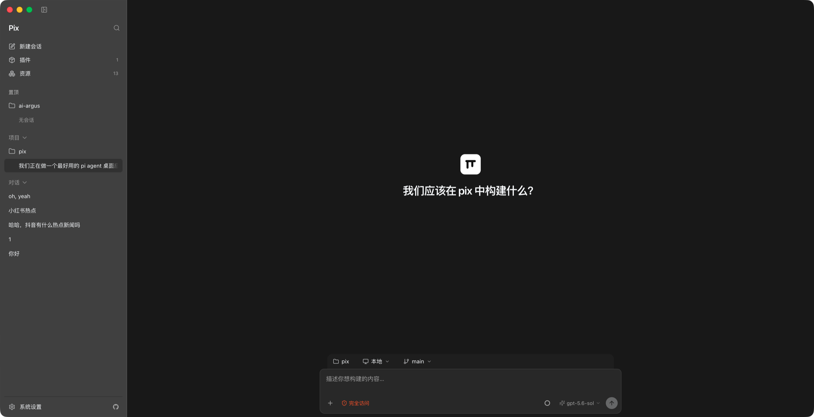

# Telos

Telos 是基于 [Pix](https://github.com/num-scope/pix) 桌面壳定制的**智能编程助手**（底层仍对接 [pi](https://pi.dev) coding agent：`~/.pi/agent`）。

上游 Pix 镜像（`G:\gitea\pix` / Gitea `sheng/pix`）为**只读**；本仓库定时拉取 Pix 源码树并保留 Telos 产品覆盖层。同步说明见 [TELOS-UPSTREAM.md](./TELOS-UPSTREAM.md)。

```powershell
.\scripts\sync-from-pix.ps1          # 拉取并合并上游
.\scripts\sync-from-pix.ps1 -FetchOnly
```

## Screenshots

（继承 Pix 桌面壳：侧栏、会话工作区、输入区）



## Requirements

- Node.js 22.19 or newer
- pnpm 11.15.1

## Setup

```bash
pnpm install
pnpm electron:install
```

`electron:install` downloads the Electron 43 runtime for your platform.

## Develop

| App                          | Dev                | Build                | Notes                                  |
| ---------------------------- | ------------------ | -------------------- | -------------------------------------- |
| **Desktop** (`apps/desktop`) | `pnpm dev:desktop` | `pnpm build:desktop` | `pnpm dev` is an alias for desktop     |
| **Landing** (`apps/landing`) | `pnpm dev:landing` | `pnpm build:landing` | Preview: `pnpm preview:landing`        |
| **All packages**             | —                  | `pnpm build`         | Recursive `build` across the workspace |

### Desktop

```bash
pnpm dev:desktop   # or: pnpm dev
pnpm build:desktop # compile only (no Electron launch)
```

Product launch uses your real `HOME` and the same agent dir as the CLI (`~/.pi/agent` / `PI_CODING_AGENT_DIR`). Models, API keys, settings, packages, and tools match interactive `pi`.

Optional isolated launch:

```bash
PIX_ISOLATED=1 pnpm dev:desktop
```

Browser-only chat timeline preview:

```bash
pnpm demo:session-content
# → http://127.0.0.1:4177/session-content-demo.html
```

### Landing page

```bash
pnpm dev:landing
pnpm build:landing
pnpm preview:landing
```

## Validate

```bash
pnpm check
pnpm check:types
pnpm fmt
pnpm test
pnpm build
```

## Package (desktop)

```bash
pnpm package
```

Output: `apps/desktop/release/app/`（产品名 **Telos**）。

## Remotes

| Remote | Purpose |
|--------|---------|
| `origin` | Telos（可推送） |
| `pix` | 本地只读上游 `G:/gitea/pix` |
| `pix-gitea` | Gitea 只读上游 |

推送 Telos 变更：

```powershell
.\scripts\git-sync.ps1 -Message "your message"
```

Never push to `pix` / `pix-gitea`.
